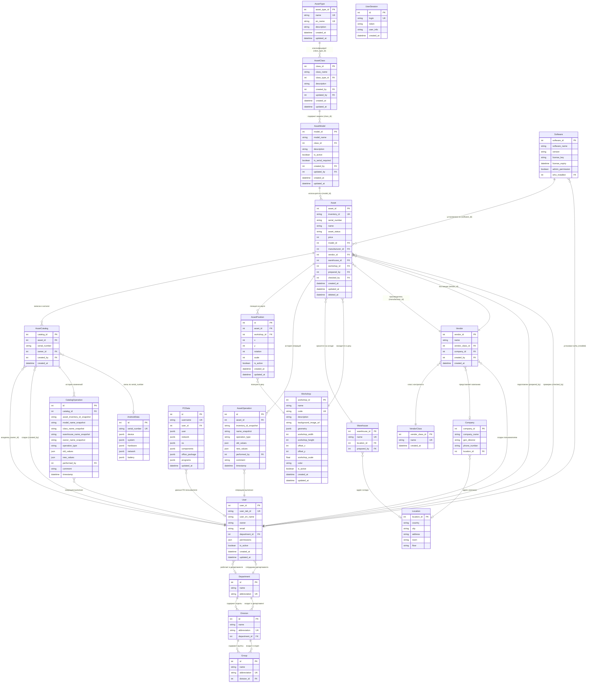

# Управление IT активами (IT Assets API)
RESTful API для управления IT-активами компании.


## Технологический стек
| Компонент             | Технология      | Назначение                           |
|:----------------------|:----------------|:-------------------------------------|
| **Язык**              | Python 3.14.3   | Основная логика приложения           |
| **Фреймворк**         | FastAPI         | Высокопроизводительный веб-фреймворк |
| **ORM**               | SQLAlchemy 2.0  | Асинхронное взаимодействие с БД      |
| **База данных**       | PostgreSQL (17) | Хранение данных об активах, типах    |
| **Миграции**          | Alembic         | Инструмент для миграций              |
| **Валидация**         | Pydantic v2     | Валидация входных/выходных данных    |
| **Драйвер БД**        | asyncpg         | Асинхронный драйвер для PostgreSQL   |
| **Контейнеротизация** | Docker Compose  | Инструмент для CI/CD                 |


## Общая структура проекта
```text
project/
├── alembic/                        # Инструмент для миграций
│   ├── versions/    
│   │   └── *.py                    # Файлы миграций
│   └── env.py                      # Скрипт конфигурации миграций
│
├── app/
│   ├── database/    
│   │   ├── crud_*.py               # CRUD операции каждой таблицы
│   │   └── connection.py           # Настройки асинхронного подключения и сессии БД
│   ├── middleware/ 
│   │   └── LoggingMiddleware.py    # Настройки логирования через middleware
│   ├── models/ 
│   │   └── *.py                    # Модели актива с полями и связями
│   ├── routers/    
│   │   └── router_*.py             # Отдельные роутеры под каждую таблицу
│   ├── schemas/                    # Схемы для каждой таблицы
│   │       └── schema/             # Схема конкретной таблицы
│   │           ├── *Create.py      # Схема создания
│   │           ├── *Response.py    # Схема ответа
│   │           ├── *Update.py      # Схема обновления
│   │           └── excel.py        # Работа с excel
│   ├── services/    
│   │   └── excel/                  # Сервис для работы с Excel файлами
│   │       └── import/export.py    # Работа с excel
│   └── main.py                     # Точка входа: создание FastAPI app, подключение роутеров, lifespan, UI, middleware
│
├── xlsx/                           # Папка для Excel файлов (оригинал + для тестов)
│
├── packages/                       # Папка с зависимостями для локальной сборки 
│   └── *.whl/                      # Файлы для сборки
│
├── alembic.ini                     # Основной конфигурационный файл Alembic
├── Dockerfile                      # Файл сборки образа контейнеров
├── docker-compose.yml              # Файл оркестрации многоконтейнерных приложений
├── entrypoint.sh                   # Исполняемый файл последовательного запуска
├── requirements.txt                # Зависимости проекта с указанными версиями
└── README.md                       # Документация проекта
```


## Настройка переменных окружения `.env`
### Обязательные поля:

База данных:
- `DB_USER` = "postgres"
- `DB_PASSWORD` = "postgres"
- `DB_NAME` = "it_assets_db"
- `DB_HOST` = "@postgres" # или при локальном запуске @localhost

### Не обязательные поля:

Секретный ключ для проверки подписи при декодировании токена:
- `JWT_SECRET_KEY` = "geasd$#3neGG!#@J#nnd28n"

> **Примечание**: Перед запуском проверить и настроить порты: `docker-compose.yml`
> 
> Ссылка для подключения к БД формируется автоматически из полей `DB_*`.
> 
> При локальном запуске необходимо использовать @localhost
> 
> Если запуск через Docker, то @postgres
---


## Пакеты Python
```python
pip download pandas-stubs==3.0.3.260530 --dest=/packages/ --no-deps
pip download psycopg2==2.9.12 --dest=/packages/ --no-deps
```

## Запуск через Docker 
C пересборкой проекта (Выполняется единожды при первом запуске):
```bash
docker compose up --build
```

При всех последующих запусков:
```bash
docker compose up -d 
```
---


## Документация API
После запуска приложения доступна интерактивная документация:
*   **Swagger:** `http://127.0.0.1:8800/docs`
*   **ReDoc:** `http://127.0.0.1:8800/redoc`
*   **Adminer:** `http://127.0.0.1:7080/` - Просмотр таблиц в веб-интерфейсе
---

## Структура базы данных
Ниже приведено подробное описание таблиц базы данных, используемых в приложении для управления IT-активами на основе моделей (**app.models**).

<details>
<summary>Таблица assets</summary>

| Колонка               | Тип данных  | Описание                                                      |
|:----------------------|:------------|:--------------------------------------------------------------|
| asset_id              | Integer     | Первичный ключ, автоинкремент                                 |
| asset_status          | String(100) | Статус актива (по умолчанию "Приемка ")                       |
| type_domain           | String(100) | Тип домена                                                    |
| asset_type_id         | Integer     | Внешний ключ на `asset_types.asset_type_id`                   |
| inventory_id          | String(50)  | Инвентарный номер (уникальный)                                |
| affixed_inventory_id  | Boolean     | Флаг: инвентарный номер наклеен                               |
| info_storage_location | String(200) | Место хранения информации об активе                           |
| location_id           | Integer     | Внешний ключ на `locations.location_id`                       |
| serial_number         | String(100) | Серийный номер (уникальный)                                   |
| name                  | String(150) | Имя актива (не nullable)                                      |
| date_issue            | Date        | Дата выдачи                                                   |
| date_purchasing       | Date        | Дата покупки                                                  |
| comment               | Text        | Комментарий                                                   |
| price                 | Integer     | Цена                                                          |
| parent_id             | Integer     | Внешний ключ на `assets.asset_id` (для иерархии/комплектации) |
| manufacturer_id       | Integer     | Внешний ключ на `vendors.vendor_id` (производитель)           |
| vendor_id             | Integer     | Внешний ключ на `vendors.vendor_id` (поставщик)               |
| prepared_by           | Integer     | Внешний ключ на `users.user_id` (кто подготовил)              |
| checked_by            | Integer     | Внешний ключ на `users.user_id` (кто проверил)                |
| deleted_at            | DateTime    | Дата мягкого удаления                                         |
| created_at            | DateTime    | Дата создания                                                 |
| updated_at            | DateTime    | Дата обновления                                               |
| software_id           | Integer     | Внешний ключ на `software.software_id`                        |
</details>

<details>
<summary>Таблица asset_classes</summary>

### Таблица: `asset_classes`
| Колонка       | Тип данных  | Описание                                                  |
|:--------------|:------------|:----------------------------------------------------------|
| class_id      | Integer     | Первичный ключ, автоинкремент                             |
| class_name    | String(100) | Название класса (не nullable, индекс)                     |
| class_type_id | Integer     | Внешний ключ на `asset_types.asset_type_id` (не nullable) |
| description   | Text        | Описание класса                                           |
| created_at    | DateTime    | Дата создания                                             |
| updated_at    | DateTime    | Дата обновления                                           |
| created_by    | Integer     | Внешний ключ на `users.user_id` (создатель)               |
| updated_by    | Integer     | Внешний ключ на `users.user_id` (обновивший)              |
</details>

<details>
<summary>Таблица asset_catalog</summary>

### Таблица: `asset_catalog`
| Колонка           | Тип данных | Описание                                                    |
|:------------------|:-----------|:------------------------------------------------------------|
| catalog_id        | Integer    | Первичный ключ, автоинкремент                               |
| class_id          | Integer    | Внешний ключ на `asset_classes.class_id` (не nullable)      |
| model_id          | Integer    | Внешний ключ на `asset_models.model_id` (не nullable)       |
| asset_id          | Integer    | Внешний ключ на `assets.asset_id` (уникальный, не nullable) |
| owner_id          | Integer    | Внешний ключ на `users.user_id` (владелец)                  |
| warehouse_id      | Integer    | Внешний ключ на `warehouses.warehouse_id`                   |
| warranty_end_date | Date       | Дата окончания гарантии                                     |
| created_at        | DateTime   | Дата создания                                               |
| created_by        | Integer    | Внешний ключ на `users.user_id` (создатель записи)          |
</details>

<details>
<summary>Таблица asset_types</summary>

### Таблица: `asset_types`
| Колонка       | Тип данных  | Описание                                |
|:--------------|:------------|:----------------------------------------|
| asset_type_id | Integer     | Первичный ключ, автоинкремент           |
| name          | String(100) | Название типа (не nullable, уникальное) |
</details>

<details>
<summary>Таблица asset_models</summary>

### Таблица: `asset_models`
| Колонка            | Тип данных  | Описание                                                 |
|:-------------------|:------------|:---------------------------------------------------------|
| model_id           | Integer     | Первичный ключ, автоинкремент                            |
| model_name         | String(150) | Название модели (не nullable, индекс)                    |
| class_id           | Integer     | Внешний ключ на `asset_classes.class_id` (не nullable)   |
| description        | Text        | Описание модели                                          |
| is_active          | Boolean     | Флаг активности модели (по умолчанию True)               |
| is_serial_required | Boolean     | Флаг обязательности серийного номера (по умолчанию True) |
| created_at         | DateTime    | Дата создания                                            |
| updated_at         | DateTime    | Дата обновления                                          |
| created_by         | Integer     | Внешний ключ на `users.user_id` (создатель)              |
| updated_by         | Integer     | Внешний ключ на `users.user_id` (обновивший)             |
</details>

<details>
<summary>Таблица companies</summary>

### Таблица: `companies`
| Колонка      | Тип данных  | Описание                                |
|:-------------|:------------|:----------------------------------------|
| company_id   | Integer     | Первичный ключ, автоинкремент           |
| company_name | String(255) | Название компании (не nullable, индекс) |
| gen_director | String(150) | Генеральный директор (ФИО)              |
| phone_number | String(50)  | Телефон компании                        |
| location_id  | Integer     | Внешний ключ на `locations.location_id` |
</details>

<details>
<summary>Таблица software</summary>

### Таблица: `software`
| Колонка          | Тип данных  | Описание                                         |
|:-----------------|:------------|:-------------------------------------------------|
| software_id      | Integer     | Первичный ключ, автоинкремент                    |
| office_type      | String(100) | Тип офисного ПО                                  |
| office_key       | String(100) | Ключ лицензии офисного ПО                        |
| os_type          | String(100) | Тип операционной системы                         |
| os_key           | String(100) | Ключ лицензии ОС                                 |
| remote_control   | String(150) | ПО удалённого управления                         |
| admin_permission | Boolean     | Наличие прав администратора (по умолчанию False) |
| who_installed    | Integer     | Внешний ключ на `users.user_id` (кто установил)  |
| installed_at     | DateTime    | Дата установки                                   |
| comment          | Text        | Комментарий                                      |
| created_at       | DateTime    | Дата создания                                    |
| updated_at       | DateTime    | Дата обновления                                  |
</details>

<details>
<summary>Таблица locations</summary>

### Таблица: `locations`
| Колонка     | Тип данных  | Описание                                                    |
|:------------|:------------|:------------------------------------------------------------|
| location_id | Integer     | Первичный ключ, автоинкремент                               |
| country     | String(100) | Страна (по умолчанию "Страна")                              |
| city        | String(100) | Город (по умолчанию "Город")                                |
| address     | String(255) | Адрес (по умолчанию "Улица и номер дома")                   |
| room        | String(50)  | Помещение/кабинет (по умолчанию "Номер помещения/кабинета") |
| floor       | String(10)  | Этаж (по умолчанию "Этаж")                                  |
</details>

<details>
<summary>Таблица users</summary>

### Таблица: `users`
| Колонка       | Тип данных  | Описание                                           |
|:--------------|:------------|:---------------------------------------------------|
| user_id       | Integer     | Первичный ключ, автоинкремент                      |
| user_tab_id   | String(50)  | Табельный номер (уникальный, индекс)               |
| owner         | String(150) | ФИО на русском (не nullable, индекс)               |
| user_en_name  | String(150) | ФИО на английском                                  |
| role          | String(40)  | Роль пользователя                                  |
| user_position | String(100) | Должность                                          |
| department    | String(100) | Отдел (индекс)                                     |
| email         | String(100) | Email (уникальный, не nullable, индекс)            |
| phone         | String(50)  | Телефон                                            |
| is_active     | Boolean     | Статус активности (по умолчанию True, не nullable) |
| created_at    | DateTime    | Дата создания                                      |
| updated_at    | DateTime    | Дата обновления                                    |
</details>

<details>
<summary>Таблица vendors</summary>

### Таблица: `vendors`
| Колонка         | Тип данных  | Описание                                                               |
|:----------------|:------------|:-----------------------------------------------------------------------|
| vendor_id       | Integer     | Первичный ключ, автоинкремент                                          |
| name            | String(255) | Название вендора/поставщика (не nullable, индекс)                      |
| vendor_class_id | Integer     | Внешний ключ на `vendor_classes.vendor_class_id` (не nullable, индекс) |
| company_id      | Integer     | Внешний ключ на `companies.company_id`                                 |
| created_by      | Integer     | Внешний ключ на `users.user_id` (создатель, не nullable)               |
| created_at      | DateTime    | Дата создания                                                          |
</details>

<details>
<summary>Таблица vendor_classes</summary>

### Таблица: `vendor_classes`
| Колонка         | Тип данных  | Описание                                                      |
|:----------------|:------------|:--------------------------------------------------------------|
| vendor_class_id | Integer     | Первичный ключ, автоинкремент, индекс                         |
| name            | String(100) | Название класса контрагента (не nullable, уникальное, индекс) |
| created_at      | DateTime    | Дата создания (не nullable)                                   |
</details>

<details>
<summary>Таблица warehouses</summary>

### Таблица: `warehouses`
| Колонка      | Тип данных  | Описание                                                |
|:-------------|:------------|:--------------------------------------------------------|
| warehouse_id | Integer     | Первичный ключ, автоинкремент, индекс                   |
| name         | String(100) | Название склада (не nullable, уникальное, индекс)       |
| location_id  | Integer     | Внешний ключ на `locations.location_id` (индекс)        |
| prepared_by  | Integer     | Внешний ключ на `users.user_id` (ответственный, индекс) |
</details>


### Схема взаимосвязей таблиц



> UserSession — это техническая таблица для хранения сессий в БД (дублирование Redis). 
> Она не участвует в бизнес-логике и связях с другими сущностями.
> Поэтому в БД будет на 1 таблицу меньше, чем в этой схеме!

## Описание основных связей

### 1. **Иерархия типов активов (3 уровня)**

```
AssetType (Тип) → AssetClass (Класс) → AssetModel (Модель) → Asset (Актив)
```

- **AssetType** — верхний уровень классификации (например, "Компьютеры", "Сетевое оборудование")
    - Имеет уникальные поля `name` и `en_name`
- **AssetClass** — средний уровень (например, "Ноутбуки", "Серверы")
    - Связан с `AssetType` через `class_type_id`
- **AssetModel** — конкретная модель (например, "ThinkPad X1 Carbon")
    - Связан с `AssetClass` через `class_id`
    - Имеет флаг `is_serial_required` (обязателен ли серийный номер)

### 2. **Asset (Активы) — центральная сущность**

Связи актива:
- **model_id** → `AssetModel` (какая модель)
- **manufacturer_id** → `Vendor` (производитель)
- **vendor_id** → `Vendor` (поставщик)
- **warehouse_id** → `Warehouse` (склад хранения)
- **workshop_id** → `Workshop` (цех размещения)
- **prepared_by** → `User` (кто подготовил)
- **checked_by** → `User` (кто проверил)

Особенности:
- Поддерживает мягкое удаление через `deleted_at`
- Имеет `price` для учёта стоимости

### 3. **AssetCatalog (Каталог активов)**

Связывает физический актив с его учётными данными:
- **asset_id** → `Asset` (сам актив)
- **serial_number** → `AndroidData` (для Android-устройств)
- **owner_id** → `User` (владелец)
- **created_by** → `User` (кто создал запись)

### 4. **Карта цехов и позиций активов**

```
Workshop (Цех) ←── AssetPosition (Позиция) ──→ Asset (Актив)
```

- **Workshop** — производственный цех
    - Может быть описан полигоном (`geometry` JSONB) или прямоугольником (`workshop_width`, `workshop_height`)
    - Имеет позицию на общей карте (`offset_x`, `offset_y`)
    - Имеет индивидуальный `workshop_scale` и `color`
- **AssetPosition** — позиция конкретного актива на карте цеха
    - Координаты `x`, `y` относительны цеха (0,0 = левый верхний угол)
    - Поддерживает `rotation` и `scale`
    - Имеет флаг `is_active` (для истории перемещений)

### 5. **Контрагенты (Vendor)**

- **Vendor** — конкретный поставщик/бренд
    - Связан с `VendorClass` (роль: производитель, поставщик, сервисный центр)
    - Опционально связан с `Company` (юридическое лицо)
- **VendorClass** — классификация контрагентов
- **Company** — юридическое лицо с адресом через `Location`

### 6. **Локации и склады**

```
Location (Адрес) ←── Company (Юрлицо)
                 ←── Warehouse (Склад)
```

- **Location** — физический адрес (страна, город, адрес, комната, этаж)
- **Warehouse** — склад, привязанный к локации
- **Company** — компания с адресом и директором

### 7. **Данные об устройствах**

- **PCData** — данные о ПК (пользователь, сеть, ОС, компоненты, программы)
    - Связан с `User` через `user_id`
    - Все технические данные в JSONB
- **AndroidData** — данные об Android-устройствах
    - Связан с `AssetCatalog` через `serial_number`
    - Данные о железе, сети, батарее в JSONB

### 8. **Пользователи и права**

**Права**:
```json
"permissions": {
    "computer": {
        "read": false,
        "write": false
    },
    "mes_equipment": {
        "read": false,
        "write": true
    },
    "supplies": {
        "read": true,
        "write": false
    },
    "power_adapter": {
        "read": true,
        "write": true
    },
    "data_collection_equipment": {
        "read": true,
        "write": true
    },
    "Accessories": {
        "read": true,
        "write": true
    },
    "network_equipment": {
        "read": true,
        "write": true
    },
    "printing_equipment": {
        "read": true,
        "write": true
    },
    "server_hardware": {
        "read": true,
        "write": true
    },
    "users": {
        "read": true,
        "write": true
    },
    "usersMU": {
        "read": true,
        "write": true
    },
    "AssetsMU": {
        "read": true,
        "write": true
    }
}
```

**Системные пользователи**:

- **root** - имеет все права
- **read** - имеет права только на чтение
- **write** - имеет права только на запись
- **android** - имеет права на роутер `/api/android-data/`  
- **pc_data** - имеет права на роутер `/api/pc-data/`  

### 9. **История операций**

- **AssetOperation** — история изменений активов
    - Сохраняет `old_values` и `new_values` (JSON)
    - Снапшоты `inventory_id_snapshot`, `name_snapshot`
- **CatalogOperation** — история изменений каталога
    - Снапшоты модели, класса, склада, владельца

### 10. **Сессии пользователей**

- **UserSession** — активные сессии
    - Хранит `token` (JWT)
    - Дублируется в Redis для быстрого доступа

---

## Ключевые особенности архитектуры

| Особенность          | Описание                                                              |
|----------------------|-----------------------------------------------------------------------|
| **Мягкое удаление**  | `Asset.deleted_at` — активы не удаляются физически                    |
| **История операций** | `AssetOperation`, `CatalogOperation` — полный аудит                   |
| **JSONB поля**       | `geometry`, `permissions`, `PCData`, `AndroidData` — гибкая структура |
| **Карта цехов**      | Относительные координаты + offset + scale для каждого цеха            |
| **Права доступа**    | Гранулярные права по типам активов (read/write)                       |
| **Самореференция**   | `Asset` может иметь иерархию (комплектующие)                          |
| **Снапшоты**         | В истории сохраняются значения на момент операции                     |


## Описание API эндпоинтов

### Роутер: Assets (`/assets`)
| Метод  | URL                             | Описание                                                                                                                                                                    |
|:-------|:--------------------------------|:----------------------------------------------------------------------------------------------------------------------------------------------------------------------------|
| POST   | `/assets/`                      | Создать новый актив. Проверяет уникальность инвентарного и серийного номеров, существование родителя, производителя, поставщика, типа актива и ответственных пользователей. |
| GET    | `/assets/`                      | Получить список активов с пагинацией (`skip`, `limit`) и фильтрацией по статусу (`asset_status`), типу (`type_id`) и наличию удаления (`deleted`).                          |
| GET    | `/assets/{asset_id}`            | Получить полную информацию об активе по ID. Возвращает 404, если актив не найден или удален.                                                                                |
| PATCH  | `/assets/{asset_id}`            | Обновить данные актива. Проверяет уникальность изменяемых полей (инвентарный номер, серийный номер) и валидность родительского актива. Запрещает циклические ссылки.        |
| POST   | `/assets/{asset_id}/deactivate` | Деактивация актива (мягкое удаление). Устанавливает дату удаления.                                                                                                          |
| POST   | `/assets/{asset_id}/activate`   | Активация актива (восстановление после мягкого удаления).                                                                                                                   |
| DELETE | `/assets/{asset_id}/hard`       | Жесткое удаление актива. Требует предварительной деактивации. Удаляет актив и всех его дочерних элементов рекурсивно.                                                       |
| GET    | `/assets/{asset_id}/children`   | Получить всех дочерних активов рекурсивно (плоский список) с опциональной глубиной вложенности (`max_depth`).                                                               |


### Роутер: Asset Types (`/assets-types`)
| Метод  | URL                             | Описание                                                                           |
|:-------|:--------------------------------|:-----------------------------------------------------------------------------------|
| POST   | `/assets-types/`                | Создать новый тип актива. Название должно быть уникальным.                         |
| GET    | `/assets-types/`                | Получить список всех типов активов.                                                |
| GET    | `/assets-types/{asset_type_id}` | Получить тип актива по ID.                                                         |
| PATCH  | `/assets-types/{asset_type_id}` | Обновить тип актива по ID.                                                         |
| DELETE | `/assets-types/{asset_type_id}` | Удалить тип актива по ID. Не позволяет удалить, если есть ссылки из других таблиц. |


### Роутер: Catalog (`/catalog`)
| Метод  | URL                                | Описание                                                                                             |
|:-------|:-----------------------------------|:-----------------------------------------------------------------------------------------------------|
| POST   | `/catalog/classes`                 | Создать новый класс оборудования.                                                                    |
| GET    | `/catalog/classes`                 | Получить список классов оборудования с пагинацией.                                                   |
| GET    | `/catalog/classes/{class_id}`      | Получить класс оборудования по ID.                                                                   |
| PATCH  | `/catalog/classes/{class_id}`      | Обновить класс оборудования по ID.                                                                   |
| DELETE | `/catalog/classes/{class_id}`      | Удалить класс оборудования по ID.                                                                    |
| POST   | `/catalog/models`                  | Создать новую модель оборудования.                                                                   |
| GET    | `/catalog/models`                  | Получить список моделей оборудования с пагинацией и опциональной фильтрацией по классу (`class_id`). |
| GET    | `/catalog/models/{model_id}`       | Получить модель оборудования по ID.                                                                  |
| PATCH  | `/catalog/models/{model_id}`       | Обновить модель оборудования по ID.                                                                  |
| GET    | `/catalog/models/{model_id}/stats` | Получить статистику (количество) активов для конкретной модели.                                      |
| POST   | `/catalog/items`                   | Добавить запись в каталог (связь актива с моделью и классом).                                        |
| GET    | `/catalog/items`                   | Получить список записей каталога с пагинацией.                                                       |
| GET    | `/catalog/items/{catalog_id}`      | Получить запись каталога по ID.                                                                      |


### Роутер: Companies (`/companies`)
| Метод  | URL                       | Описание                                                                 |
|:-------|:--------------------------|:-------------------------------------------------------------------------|
| POST   | `/companies/`             | Создать новую компанию. Проверяет уникальность названия.                 |
| GET    | `/companies/`             | Получить список компаний с пагинацией (`skip`, `limit`).                 |
| GET    | `/companies/{company_id}` | Получить компанию по ID.                                                 |
| PATCH  | `/companies/{company_id}` | Обновить данные компании. Проверяет уникальность названия при изменении. |
| DELETE | `/companies/{company_id}` | Удалить компанию по ID.                                                  |


### Роутер: Assets Excel (`/assets/excel`)
| Метод | URL                      | Описание                                                                         |
|:------|:-------------------------|:---------------------------------------------------------------------------------|
| GET   | `/assets/excel/export`   | Экспорт списка активов в файл Excel. Поддерживает пагинацию (`skip`, `limit`).   |
| GET   | `/assets/excel/template` | Скачать шаблон Excel файла для импорта активов.                                  |
| POST  | `/assets/excel/import`   | Импортировать активы из загруженного Excel файла. Возвращает результаты импорта. |


### Роутер: Vendors (`/vendors`)
| Метод  | URL                    | Описание                                                                                                                               |
|:-------|:-----------------------|:---------------------------------------------------------------------------------------------------------------------------------------|
| POST   | `/vendors/`            | Создать нового вендора или поставщика.                                                                                                 |
| GET    | `/vendors/`            | Получить список вендоров с пагинацией (`skip`, `limit`) и фильтрацией по классу вендора (`vendor_class_id`) и компании (`company_id`). |
| GET    | `/vendors/{vendor_id}` | Получить информацию о вендоре по ID.                                                                                                   |
| PATCH  | `/vendors/{vendor_id}` | Обновить данные вендора по ID.                                                                                                         |
| DELETE | `/vendors/{vendor_id}` | Удалить вендора по ID.                                                                                                                 |


### Роутер: Locations (`/locations`)
| Метод  | URL                        | Описание                                                                                                      |
|:-------|:---------------------------|:--------------------------------------------------------------------------------------------------------------|
| POST   | `/locations/`              | Создать новую локацию (адрес/помещение).                                                                      |
| GET    | `/locations/`              | Получить список локаций с пагинацией (`skip`, `limit`) и фильтрацией по городу (`city`) и стране (`country`). |
| GET    | `/locations/{location_id}` | Получить полную информацию о локации по ID.                                                                   |
| PATCH  | `/locations/{location_id}` | Обновить данные локации по ID.                                                                                |
| DELETE | `/locations/{location_id}` | Удалить локацию по ID.                                                                                        |


### Роутер: Vendor Classes (`/vendor-classes`)
| Метод  | URL                                 | Описание                                                                                               |
|:-------|:------------------------------------|:-------------------------------------------------------------------------------------------------------|
| POST   | `/vendor-classes/`                  | Создать новый класс вендора (например, "Производитель", "Поставщик"). Проверяет уникальность названия. |
| GET    | `/vendor-classes/`                  | Получить список классов вендоров с пагинацией (`skip`, `limit`).                                       |
| GET    | `/vendor-classes/{vendor_class_id}` | Получить класс вендора по ID.                                                                          |
| PATCH  | `/vendor-classes/{vendor_class_id}` | Обновить класс вендора. Проверяет уникальность названия при изменении.                                 |
| DELETE | `/vendor-classes/{vendor_class_id}` | Удалить класс вендора по ID.                                                                           |


### Роутер: Users (`/users`)
| Метод  | URL                           | Описание                                                                                                                                |
|:-------|:------------------------------|:----------------------------------------------------------------------------------------------------------------------------------------|
| POST   | `/users/`                     | Создать нового пользователя (сотрудника). Проверяет уникальность email и табельного номера.                                             |
| GET    | `/users/`                     | Получить список пользователей с пагинацией (`skip`, `limit`) и фильтрацией по отделу (`department`) и статусу активности (`is_active`). |
| GET    | `/users/{user_id}`            | Получить пользователя по ID.                                                                                                            |
| PATCH  | `/users/{user_id}`            | Обновить данные пользователя. Проверяет уникальность email и табельного номера при изменении.                                           |
| POST   | `/users/{user_id}/activate`   | Активировать пользователя. Возвращает ошибку, если пользователь уже активен.                                                            |
| POST   | `/users/{user_id}/deactivate` | Деактивировать пользователя. Возвращает ошибку, если пользователь уже деактивирован.                                                    |
| DELETE | `/users/{user_id}`            | Жестко удалить пользователя. Разрешено только для деактивированных пользователей.                                                       |


### Роутер: Software (`/software`)
| Метод  | URL                              | Описание                                                                                                                                   |
|:-------|:---------------------------------|:-------------------------------------------------------------------------------------------------------------------------------------------|
| POST   | `/software/`                     | Создать новую запись о программном обеспечении.                                                                                            |
| GET    | `/software/`                     | Получить список ПО с пагинацией (`skip`, `limit`) и фильтрацией по наличию прав администратора (`admin_permission`) и типу ОС (`os_type`). |
| GET    | `/software/{software_id}`        | Получить запись о ПО по ID.                                                                                                                |
| PATCH  | `/software/{software_id}`        | Обновить запись о ПО по ID.                                                                                                                |
| DELETE | `/software/{software_id}`        | Удалить запись о ПО. Запрещено, если ПО привязано к активным активам.                                                                      |
| GET    | `/software/{software_id}/assets` | Получить список активов, на которых установлено данное ПО.                                                                                 |


### Роутер: Warehouses (`/warehouses`)
| Метод  | URL                          | Описание                                                                         |
|:-------|:-----------------------------|:---------------------------------------------------------------------------------|
| POST   | `/warehouses/`               | Создать новый склад. Проверяет уникальность названия склада.                     |
| GET    | `/warehouses/`               | Получить список всех складов с пагинацией (`skip`, `limit`).                     |
| GET    | `/warehouses/{warehouse_id}` | Получить полную информацию о складе по ID. Возвращает 404, если склад не найден. |
| PATCH  | `/warehouses/{warehouse_id}` | Обновить данные склада по ID. Проверяет уникальность названия при изменении.     |
| DELETE | `/warehouses/{warehouse_id}` | Удалить склад по ID. Возвращает 204 при успешном удалении.                       |


## Карта цехов

### Конфигурация карты

Размеры карты хранятся в Redis и могут быть изменены через API:

```bash
# Получить конфигурацию
GET /api/map-config/

# Обновить размеры
PATCH /api/map-config/
{
  "map_width": 3000,
  "map_height": 2500
}

# Сбросить к значениям по умолчанию
POST /api/map-config/reset
```

### Управление цехами

#### Создание цеха

```bash
POST /api/workshops/
{
  "name": "Цех сборки",
  "code": "1-04",
  "workshop_width": 800,
  "workshop_height": 600,
  "offset_x": 200,
  "offset_y": 150,
  "workshop_scale": 1.5,
  "color": "#FF5733"
}
```

#### Создание цеха со сложной геометрией (Г-образный)
> Примечание: Используется экранная система координат ( (0,0) - левый верхний, (2000,2000) - правый нижний угол) 
```bash
POST /api/workshops/
{
  "name": "Цех сборки",
  "code": "1-04",
  "geometry": {
    "type": "polygon",
    "coordinates": [
      [75, 600],
      [1050, 600],
      [1050, 0],
      [750, 0],
      [750, 225],
      [75, 225]
    ]
  },
  "offset_x": 75,
  "offset_y": 0,
  "workshop_scale": 1.0,
  "color": "#5F7A72"
}
```

#### Обновление цеха

```bash
PATCH /api/workshops/{workshop_id}
{
  "workshop_scale": 2.0,
  "color": "#00FF00",
  "offset_x": 300,
  "offset_y": 200
}
```

### Просмотр карты

#### Карта одного цеха

```bash
GET /api/workshops/map/{workshop_id}
```

Возвращает HTML-страницу с интерактивной SVG-картой цеха с возможностью:
- Zoom (колесико мыши, кнопки)
- Pan (перетаскивание)
- Переключение темы (тёмная/белая)

#### Карта всех цехов

```bash
GET /api/workshops/map
```

Возвращает HTML-страницу с картой всех активных цехов и связанными с ними активами.

### Параметры цеха

| Параметр          | Тип    | Описание                          |
|-------------------|--------|-----------------------------------|
| `name`            | string | Название цеха                     |
| `code`            | string | Уникальный код (например, "1-04") |
| `workshop_width`  | int    | Ширина прямоугольника цеха        |
| `workshop_height` | int    | Высота прямоугольника цеха        |
| `geometry`        | dict   | Сложная геометрия (полигон)       |
| `offset_x`        | int    | Смещение по X на общей карте      |
| `offset_y`        | int    | Смещение по Y на общей карте      |
| `workshop_scale`  | float  | Масштаб цеха (0.1 - 10.0)         |
| `color`           | string | Цвет цеха в hex формате (#RRGGBB) |


### Размещение актива на карте

```bash
POST /api/asset-positions/
{
  "asset_id": 1,
  "workshop_id": 2,
  "x": 100,
  "y": 200,
  "rotation": 0,
  "scale": 1
}
```

**Важно:** Координаты `x` и `y` относительны цеха (0,0 = левый верхний угол цеха).
