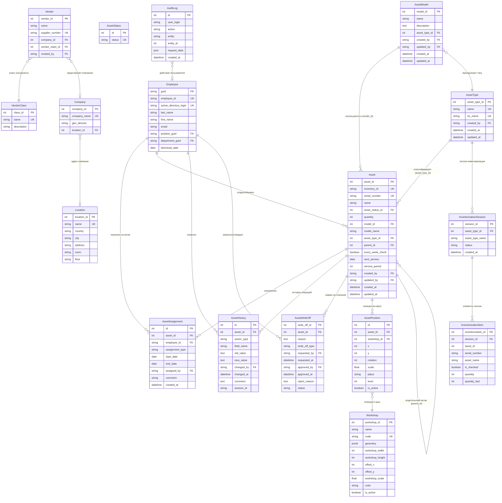

# Управление IT активами (IT Assets API)
RESTful API для управления IT-активами компании.

## Технологический стек
| Компонент             | Технология      | Назначение                           |
|:----------------------|:----------------|:-------------------------------------|
| **Язык**              | Python 3.14.3   | Основная логика приложения           |
| **Фреймворк**         | FastAPI         | Высокопроизводительный веб-фреймворк |
| **ORM**               | SQLAlchemy 2.0  | Асинхронное взаимодействие с БД      |
| **База данных**       | PostgreSQL (17) | Хранение данных об активах, типах    |
| **Миграции**          | Alembic         | Инструмент для миграций              |
| **Валидация**         | Pydantic v2     | Валидация входных/выходных данных    |
| **Драйвер БД**        | asyncpg         | Асинхронный драйвер для PostgreSQL   |
| **Контейнеротизация** | Docker Compose  | Инструмент для CI/CD                 |

## Общая структура проекта
```text
project/
├── alembic/                                    # Инструмент для миграций БД
│   ├── versions/                               # Файлы миграций
│   └── env.py                                  # Скрипт конфигурации миграций
│
├── app/
│   ├── database/                               # Работа с базой данных (CRUD)
│   │   ├── analytics/                          # CRUD для аналитики
│   │   ├── assets/                             # CRUD для активов и связанных сущностей
│   │   │   ├── __init__.py
│   │   │   ├── crud_asset.py
│   │   │   ├── crud_asset_assignment.py
│   │   │   ├── crud_asset_history.py
│   │   │   ├── crud_asset_model.py
│   │   │   ├── crud_asset_status.py
│   │   │   ├── crud_asset_type.py
│   │   │   ├── crud_asset_write_off.py
│   │   │   └── crud_inventorization.py
│   │   ├── map_assets/                         # CRUD для карты и позиций
│   │   │   ├── __init__.py
│   │   │   ├── crud_asset_position.py
│   │   │   └── crud_workshop.py
│   │   ├── zup/                                # CRUD для интеграции с 1С-ЗУП
│   │   │   ├── __init__.py
│   │   │   ├── crud_zup_departments.py
│   │   │   ├── crud_zup_employees.py
│   │   │   ├── crud_zup_managers.py
│   │   │   └── crud_zup_positions.py
│   │   ├── __init__.py
│   │   ├── connection.py                       # Настройки асинхронного подключения и сессии БД
│   │   ├── crud_android_data.py
│   │   ├── crud_audit.py
│   │   ├── crud_companies.py
│   │   ├── crud_locations.py
│   │   ├── crud_notifications.py
│   │   ├── crud_pc_data.py
│   │   ├── crud_vendor_classes.py
│   │   └── crud_vendors.py
│   │
│   ├── frontend/                               # Фронтенд-часть (проверка карты)
│   │
│   ├── middleware/                             # Middleware приложения
│   │   ├── __init__.py
│   │   ├── AuthTokenMiddleware.py              # Проверка JWT-токенов и прав доступа
│   │   └── LoggingMiddleware.py                # Логирование HTTP-запросов
│   │
│   ├── models/                                 # SQLAlchemy модели (таблицы БД)
│   │   ├── assets/                             # Модели активов (Asset, AssetType, AssetModel, и др.)
│   │   ├── map_assets/                         # Модели карты (Workshop, AssetPosition)
│   │   ├── notifications/                      # Модели уведомлений
│   │   ├── zup/                                # Модели сотрудников ЗУП (employee, department, и др.)
│   │   ├── AndroidData.py
│   │   ├── AuditLog.py
│   │   ├── Base.py                             # Базовый класс SQLAlchemy
│   │   ├── Company.py
│   │   ├── Location.py
│   │   ├── PCData.py
│   │   ├── UserJWTData.py
│   │   ├── Vendor.py
│   │   ├── VendorClass.py
│   │   └── __init__.py
│   │
│   ├── routers/                                # Роутеры и эндпоинты
│   │   ├── assets/                             # Роутеры для активов
│   │   │   ├── __init__.py
│   │   │   ├── router_asset.py
│   │   │   ├── router_asset_assignment.py
│   │   │   ├── router_asset_history.py
│   │   │   ├── router_asset_model.py
│   │   │   ├── router_asset_status.py
│   │   │   ├── router_asset_type.py
│   │   │   ├── router_asset_write_off.py
│   │   │   └── router_inventorization.py
│   │   ├── map_assets/                         # Роутеры для карты
│   │   │   ├── __init__.py
│   │   │   ├── router_asset_positions.py
│   │   │   ├── router_map.py
│   │   │   └── router_workshop.py
│   │   ├── __init__.py
│   │   ├── router_analytics.py
│   │   ├── router_android_data.py
│   │   ├── router_audit.py
│   │   ├── router_auth.py
│   │   ├── router_companies.py
│   │   ├── router_locations.py
│   │   ├── router_notifications.py
│   │   ├── router_pc_data.py
│   │   ├── router_vendor_classes.py
│   │   ├── router_vendors.py
│   │   └── router_zup.py
│   │
│   ├── scheduler/                              # Планировщик фоновых задач
│   │   ├── jobs/                               # Конкретные задачи (jobs)
│   │   ├── __init__.py
│   │   └── scheduler.py                        # Инициализация и запуск AsyncIOScheduler
│   │
│   ├── schemas/                                # Pydantic-схемы (валидация данных)
│   │   ├── analytics/
│   │   ├── android_data/
│   │   ├── assets/
│   │   ├── audit/
│   │   ├── auth/
│   │   ├── companies/
│   │   ├── locations/
│   │   ├── map_assets/
│   │   ├── notifications/
│   │   ├── pc_data/
│   │   ├── vendors/
│   │   ├── zup/
│   │   ├── PaginationResponse.py
│   │   └── __init__.py
│   │
│   ├── services/                               # Бизнес-логика и внешние интеграции
│   │   ├── android/                            # Сервис управления Android-устройствами
│   │   │   ├── __init__.py
│   │   │   └── command_manager.py
│   │   ├── auth/                               # Сервис аутентификации и авторизации
│   │   │   ├── __init__.py
│   │   │   ├── auth_service.py
│   │   │   ├── external_auth.py
│   │   │   ├── permission_checker.py
│   │   │   └── system_users.py
│   │   ├── zup/                                # Сервис интеграции с 1С-ЗУП
│   │   │   ├── __init__.py
│   │   │   └── zup_integration.py
│   │   └── __init__.py
│   │
│   ├── __init__.py
│   └── main.py                                 # Точка входа: создание FastAPI app, подключение роутеров, lifespan, UI, middleware
│
├── xlsx/                                       # Папка для Excel файлов (шаблоны, тесты)
│
├── packages/                                   # Зависимости для локальной сборки (*.whl)
│
├── alembic.ini                                 # Основной конфигурационный файл Alembic
├── Dockerfile                                  # Файл сборки образа контейнеров
├── docker-compose.yml                          # Файл оркестрации многоконтейнерных приложений
├── entrypoint.sh                               # Исполняемый файл последовательного запуска
├── requirements.txt                            # Зависимости проекта с указанными версиями
├── .env                                        # Переменные окружения (не коммитится)
└── README.md                                   # Документация проекта
```

## Настройка переменных окружения `.env`
### Обязательные поля:

База данных:
- `DB_USER` = "postgres"
- `DB_PASSWORD` = "postgres"
- `DB_NAME` = "it_assets_db"
- `DB_HOST` = "@postgres" # или при локальном запуске @localhost

### Не обязательные поля:

Секретный ключ для проверки подписи при декодировании токена:
- `JWT_SECRET_KEY` = "***********************"

> **Примечание**: Перед запуском проверить и настроить порты: `docker-compose.yml`
>
> Ссылка для подключения к БД формируется автоматически из полей `DB_*`.
>
> При локальном запуске необходимо использовать @localhost
>
> Если запуск через Docker, то @postgres
---

## Пакеты Python
Смотри файл `requirements.txt`

*Примечание: добавлены зависимости для AsyncIOScheduler.*

## Запуск через Docker
C пересборкой проекта (Выполняется единожды при первом запуске):
```bash
docker compose up --build
```

При всех последующих запусков:
```bash
docker compose up -d 
```
---

## Документация API
После запуска приложения доступна интерактивная документация:
*   **Swagger:** `http://127.0.0.1:8800/docs`
*   **ReDoc:** `http://127.0.0.1:8800/redoc`
*   **Adminer:** `http://127.0.0.1:7080/` - Просмотр таблиц в веб-интерфейсе
---

## Структура базы данных
Ниже приведено подробное описание таблиц базы данных, используемых в приложении для управления IT-активами на основе моделей.

<details>
<summary>Таблица assets</summary>

### Таблица: `assets`
| Колонка               | Тип данных  | Описание                                                      |
|:----------------------|:------------|:--------------------------------------------------------------|
| asset_id              | Integer     | Первичный ключ, автоинкремент                                 |
| name                  | String(150) | Имя актива (не nullable, индекс)                              |
| inventory_id          | String(100) | Инвентарный номер (уникальный, индекс, не nullable)           |
| serial_number         | String(100) | Серийный номер (уникальный, индекс, nullable)                 |
| asset_status_id       | Integer     | Внешний ключ на `asset_status.id`                             |
| quantity              | Integer     | Количество (по умолчанию 1)                                   |
| comment               | Text        | Комментарий                                                   |
| date_issue            | Date        | Дата выдачи                                                   |
| date_purchasing       | Date        | Дата покупки                                                  |
| model_id              | Integer     | Внешний ключ на `asset_models.model_id`                       |
| model_name            | String(300) | Название модели (денормализованное)                           |
| parent_name           | String(100) | Название родителя (денормализованное)                         |
| manufacturer_name     | String(100) | Название производителя (денормализованное)                    |
| vendor_name           | String(100) | Название поставщика (денормализованное)                       |
| os_name               | String(100) | Название ОС (денормализованное)                               |
| asset_type_id         | Integer     | Внешний ключ на `asset_types.asset_type_id`                   |
| parent_id             | Integer     | Внешний ключ на `assets.asset_id` (для иерархии комплектации) |
| every_week_check      | Boolean     | Флаг еженедельной проверки                                    |
| next_service          | Date        | Дата следующего обслуживания                                  |
| service_period        | Integer     | Период обслуживания в днях                                    |
| created_by            | String(20)  | Внешний ключ на `zup_employees.employee_id`                   |
| updated_by            | String(20)  | Внешний ключ на `zup_employees.employee_id`                   |
| created_at            | DateTime    | Дата создания                                                 |
| updated_at            | DateTime    | Дата обновления                                               |
</details>

<details>
<summary>Таблица asset_types</summary>

### Таблица: `asset_types`
| Колонка       | Тип данных  | Описание                                |
|:--------------|:------------|:----------------------------------------|
| asset_type_id | Integer     | Первичный ключ, автоинкремент           |
| name          | String(100) | Название типа (не nullable, уникальное) |
| en_name       | String(100) | Название типа на английском (уникальное)|
| created_by    | String(20)  | Внешний ключ на `zup_employees.employee_id` |
| created_at    | DateTime    | Дата создания                           |
| updated_at    | DateTime    | Дата обновления                         |
</details>

<details>
<summary>Таблица asset_models</summary>

### Таблица: `asset_models`
| Колонка       | Тип данных  | Описание                                                 |
|:--------------|:------------|:---------------------------------------------------------|
| model_id      | Integer     | Первичный ключ, автоинкремент                            |
| name          | String(150) | Название модели (не nullable, индекс)                    |
| description   | Text        | Описание модели                                          |
| asset_type_id | Integer     | Внешний ключ на `asset_types.asset_type_id`              |
| created_by    | String(20)  | Внешний ключ на `zup_employees.employee_id`              |
| updated_by    | String(20)  | Внешний ключ на `zup_employees.employee_id`              |
| created_at    | DateTime    | Дата создания                                            |
| updated_at    | DateTime    | Дата обновления                                          |
</details>

<details>
<summary>Таблица asset_assignments</summary>

### Таблица: `asset_assignments`
| Колонка          | Тип данных  | Описание                                                    |
|:-----------------|:------------|:------------------------------------------------------------|
| id               | Integer     | Первичный ключ, автоинкремент                               |
| asset_id         | Integer     | Внешний ключ на `assets.asset_id`                           |
| employee_id      | String(20)  | Внешний ключ на `zup_employees.employee_id`                 |
| assignment_type  | String(20)  | Тип назначения: "user" или "responsible"                    |
| start_date       | Date        | Дата начала назначения                                      |
| end_date         | Date        | Дата окончания (NULL = активная связь)                      |
| assigned_by      | String(20)  | Внешний ключ на `zup_employees.employee_id` (кто назначил)  |
| comment          | String(500) | Комментарий                                                 |
| created_at       | DateTime    | Дата создания                                               |
</details>

<details>
<summary>Таблица asset_status</summary>

### Таблица: `asset_status`
| Колонка | Тип данных  | Описание                          |
|:--------|:------------|:----------------------------------|
| id      | Integer     | Первичный ключ, автоинкремент     |
| status  | String(100) | Название статуса (уникальное)     |
</details>

<details>
<summary>Таблица asset_history</summary>

### Таблица: `asset_history`
| Колонка     | Тип данных  | Описание                                                    |
|:------------|:------------|:------------------------------------------------------------|
| id          | Integer     | Первичный ключ, автоинкремент                               |
| asset_id    | Integer     | Внешний ключ на `assets.asset_id`                           |
| action_type | String(50)  | Тип действия (create, update, delete, assign, move и др.)   |
| field_name  | String(100) | Название измененного поля                                   |
| old_value   | Text        | Старое значение                                             |
| new_value   | Text        | Новое значение                                              |
| changed_by  | String(20)  | Внешний ключ на `zup_employees.employee_id`                 |
| changed_at  | DateTime    | Дата изменения                                              |
| comment     | Text        | Комментарий к изменению                                     |
| session_id  | String(36)  | UUID для группировки изменений в одну операцию               |
</details>

<details>
<summary>Таблица asset_write_offs</summary>

### Таблица: `asset_write_offs`
| Колонка        | Тип данных  | Описание                                                    |
|:---------------|:------------|:------------------------------------------------------------|
| write_off_id   | Integer     | Первичный ключ, автоинкремент                               |
| asset_id       | Integer     | Внешний ключ на `assets.asset_id`                           |
| reason         | Text        | Причина списания                                            |
| write_off_type | String(50)  | Тип списания (broken, lost, obsolete, sold, other)          |
| requested_by   | String(20)  | Внешний ключ на `zup_employees.employee_id` (заявитель)     |
| requested_at   | DateTime    | Дата запроса                                                |
| approved_by    | String(20)  | Внешний ключ на `zup_employees.employee_id` (утвердивший)   |
| approved_at    | DateTime    | Дата утверждения                                            |
| reject_reason  | Text        | Причина отказа                                              |
| status         | String(20)  | Статус (pending, approved, rejected)                        |
</details>

<details>
<summary>Таблица inventorization_sessions</summary>

### Таблица: `inventorization_sessions`
| Колонка           | Тип данных  | Описание                                                    |
|:------------------|:------------|:------------------------------------------------------------|
| session_id        | Integer     | Первичный ключ, автоинкремент                               |
| asset_type_id     | Integer     | Внешний ключ на `asset_types.asset_type_id`                 |
| asset_type_name   | String(100) | Название типа актива                                        |
| asset_type_en_name| String(100) | Название типа актива на английском                          |
| status            | String(50)  | Статус (in_progress, completed)                             |
| created_at        | DateTime    | Дата создания                                               |
</details>

<details>
<summary>Таблица inventorization_items</summary>

### Таблица: `inventorization_items`
| Колонка          | Тип данных  | Описание                                                    |
|:-----------------|:------------|:------------------------------------------------------------|
| inventorization_id| Integer    | Первичный ключ, автоинкремент                               |
| session_id       | Integer     | Внешний ключ на `inventorization_sessions.session_id`       |
| asset_id         | Integer     | ID актива (без внешнего ключа для сохранения истории)       |
| serial_number    | String(100) | Серийный номер                                              |
| asset_name       | String(150) | Название актива                                             |
| is_checked       | Boolean     | Флаг проверки                                               |
| quantity         | Integer     | Ожидаемое количество                                        |
| quantity_fact    | Integer     | Фактическое количество                                      |
</details>

<details>
<summary>Таблица zup_employees</summary>

### Таблица: `zup_employees`
| Колонка                | Тип данных  | Описание                                                    |
|:-----------------------|:------------|:------------------------------------------------------------|
| guid                   | String(36)  | Первичный ключ, UUID из 1С                                  |
| guid_person            | String(36)  | Ссылка на физическое лицо                                   |
| employee_id            | String(20)  | Табельный номер (уникальный, индекс)                        |
| active_directory_login | String(20)  | Логин Active Directory (уникальный)                         |
| comment                | String(1000)| Комментарий                                                 |
| last_name              | String(100) | Фамилия на русском                                          |
| first_name             | String(100) | Имя на русском                                              |
| middle_name            | String(100) | Отчество на русском                                         |
| last_name_en           | String(100) | Фамилия на английском                                       |
| first_name_en          | String(100) | Имя на английском                                           |
| middle_name_en         | String(100) | Отчество на английском                                      |
| birth_date             | Date        | Дата рождения                                               |
| employment_date        | Date        | Дата приема на работу                                       |
| dismissal_date         | Date        | Дата увольнения (NULL = действующий)                        |
| phone                  | String(20)  | Телефон                                                     |
| email                  | String(100) | Email                                                       |
| position_guid          | String(36)  | GUID должности                                              |
| department_guid        | String(36)  | GUID подразделения                                          |
| created_at             | DateTime    | Дата создания                                               |
| updated_at             | DateTime    | Дата обновления                                             |
</details>

<details>
<summary>Таблица locations</summary>

### Таблица: `locations`
| Колонка     | Тип данных  | Описание                                                    |
|:------------|:------------|:------------------------------------------------------------|
| location_id | Integer     | Первичный ключ, автоинкремент                               |
| name        | String(100) | Название локации (уникальное)                               |
| country     | String(100) | Страна                                                      |
| city        | String(100) | Город                                                       |
| address     | String(255) | Адрес                                                       |
| room        | String(50)  | Помещение/кабинет                                           |
| floor       | String(10)  | Этаж                                                        |
| created_by  | String(20)  | Внешний ключ на `zup_employees.employee_id`                 |
| created_at  | DateTime    | Дата создания                                               |
| updated_at  | DateTime    | Дата обновления                                             |
</details>

<details>
<summary>Таблица companies</summary>

### Таблица: `companies`
| Колонка      | Тип данных  | Описание                                |
|:-------------|:------------|:----------------------------------------|
| company_id   | Integer     | Первичный ключ, автоинкремент           |
| company_name | String(255) | Название компании (уникальное)          |
| gen_director | String(150) | Генеральный директор (ФИО)              |
| phone_number | String(50)  | Телефон компании                        |
| location_id  | Integer     | Внешний ключ на `locations.location_id` |
| created_by   | String(20)  | Внешний ключ на `zup_employees.employee_id` |
| created_at   | DateTime    | Дата создания                           |
| updated_at   | DateTime    | Дата обновления                         |
</details>

<details>
<summary>Таблица vendor_classes</summary>

### Таблица: `vendor_classes`
| Колонка     | Тип данных  | Описание                                                      |
|:------------|:------------|:--------------------------------------------------------------|
| class_id    | Integer     | Первичный ключ, автоинкремент                                 |
| name        | String(100) | Название класса контрагента (уникальное)                      |
| description | String(300) | Описание                                                      |
| created_by  | String(20)  | Внешний ключ на `zup_employees.employee_id`                   |
| created_at  | DateTime    | Дата создания                                                 |
| updated_at  | DateTime    | Дата обновления                                               |
</details>

<details>
<summary>Таблица vendors</summary>

### Таблица: `vendors`
| Колонка         | Тип данных  | Описание                                                               |
|:----------------|:------------|:-----------------------------------------------------------------------|
| vendor_id       | Integer     | Первичный ключ, автоинкремент                                          |
| name            | String(150) | Название вендора/поставщика                                            |
| supplier_number | String(50)  | Номер поставщика (уникальный)                                          |
| contact_person  | String(150) | Контактное лицо                                                        |
| phone           | String(50)  | Телефон                                                                |
| email           | String(100) | Email                                                                  |
| address         | String(300) | Адрес                                                                  |
| description     | String(500) | Описание                                                               |
| company_id      | Integer     | Внешний ключ на `companies.company_id`                                 |
| vendor_class_id | Integer     | Внешний ключ на `vendor_classes.class_id`                              |
| created_by      | String(20)  | Внешний ключ на `zup_employees.employee_id`                            |
| created_at      | DateTime    | Дата создания                                                          |
| updated_at      | DateTime    | Дата обновления                                                        |
</details>

<details>
<summary>Таблица asset_positions</summary>

### Таблица: `asset_positions`
| Колонка     | Тип данных  | Описание                                                    |
|:------------|:------------|:------------------------------------------------------------|
| id          | Integer     | Первичный ключ, автоинкремент                               |
| asset_id    | Integer     | Внешний ключ на `assets.asset_id`                           |
| workshop_id | Integer     | Внешний ключ на `workshops.workshop_id`                     |
| x           | Integer     | Координата X относительно цеха                              |
| y           | Integer     | Координата Y относительно цеха                              |
| rotation    | Integer     | Угол поворота                                               |
| scale       | Float       | Масштаб                                                     |
| place       | String(100) | Линия/помещение                                             |
| level       | Integer     | Этаж (по умолчанию 0)                                       |
| is_active   | Boolean     | Флаг активности позиции                                     |
| created_at  | DateTime    | Дата создания                                               |
| updated_at  | DateTime    | Дата обновления                                             |
</details>

<details>
<summary>Таблица workshops</summary>

### Таблица: `workshops`
| Колонка              | Тип данных  | Описание                                                |
|:---------------------|:------------|:--------------------------------------------------------|
| workshop_id          | Integer     | Первичный ключ, автоинкремент                           |
| name                 | String(100) | Название цеха                                           |
| code                 | String(50)  | Уникальный код цеха                                     |
| description          | String(500) | Описание                                                |
| background_image_url | String(300) | URL фонового изображения                                |
| geometry             | JSONB       | Сложная геометрия (полигон)                             |
| workshop_width       | Integer     | Ширина прямоугольника цеха                              |
| workshop_height      | Integer     | Высота прямоугольника цеха                              |
| offset_x             | Integer     | Смещение по X на общей карте                            |
| offset_y             | Integer     | Смещение по Y на общей карте                            |
| workshop_scale       | Float       | Масштаб цеха                                            |
| color                | String(20)  | Цвет цеха в hex формате                                 |
| is_active            | Boolean     | Флаг активности                                         |
| created_at           | DateTime    | Дата создания                                           |
| updated_at           | DateTime    | Дата обновления                                         |
</details>

<details>
<summary>Таблица audit_logs</summary>

### Таблица: `audit_logs`
| Колонка      | Тип данных  | Описание                                                    |
|:-------------|:------------|:------------------------------------------------------------|
| id           | Integer     | Первичный ключ, автоинкремент                               |
| user_login   | String      | Логин пользователя                                          |
| action       | String      | Действие (например, "POST /api/assets")                     |
| entity       | String      | Сущность                                                    |
| entity_id    | Integer     | ID записи                                                   |
| request_data | JSON        | Тело запроса/параметры                                      |
| created_at   | DateTime    | Дата создания                                               |
</details>

### Схема взаимосвязей таблиц



## Описание основных связей

### 1. **Классификация активов**

```
AssetType (Тип) ---> Asset (Актив)
AssetModel (Модель) ---> Asset (Актив)
```

- **AssetType** — тип актива (например, "Компьютеры", "Сетевое оборудование"). Имеет уникальные поля `name` и `en_name`.
- **AssetModel** — конкретная модель (например, "ThinkPad X1 Carbon"). Связана с `AssetType` через `asset_type_id`.
- Промежуточная сущность `AssetClass` (Класс) удалена. Тип и модель связаны с активом напрямую, без многоуровневой иерархии.

### 2. **Asset (Активы) — центральная сущность**

Связи актива:
- **asset_type_id** → `AssetType` (тип актива)
- **model_id** → `AssetModel` (модель)
- **parent_id** → `Asset` (родительский актив для иерархии комплектации)
- **asset_status_id** → `AssetStatus` (текущий статус)

Особенности:
- Поддерживает мягкое удаление через логику статусов и историю.
- Имеет поля для сервисного обслуживания: `every_week_check`, `next_service`, `service_period`.
- Содержит денормализованные текстовые поля (`model_name`, `parent_name`, `manufacturer_name`, `vendor_name`, `os_name`) для оптимизации выборок.
- Аудит: `created_by`, `updated_by` ссылаются на `zup_employees.employee_id`.

### 3. **AssetAssignment (Назначения активов)**

Заменяет удаленную таблицу `AssetCatalog`. Связывает физический актив с сотрудником:
- **asset_id** → `Asset` (сам актив)
- **employee_id** → `zup_employees.employee_id` (сотрудник)
- **assignment_type**: "user" (пользователь) или "responsible" (ответственный).
- **start_date**, **end_date**: временные рамки назначения. Значение `NULL` в `end_date` означает активную связь.
- **assigned_by**: сотрудник, оформивший назначение.

### 4. **История операций и аудит**

- **AssetHistory**: детальная история изменений актива. Сохраняет `action_type` (create, update, delete, assign, unassign, move, status_change), `field_name`, `old_value`, `new_value`. Поле `session_id` позволяет группировать несколько изменений в одну логическую операцию.
- **AuditLog**: общий журнал HTTP-запросов и действий пользователей (логин, действие, сущность, ID, данные запроса).

### 5. **Списание активов (AssetWriteOff)**

- Реализован полноценный workflow списания: `requested_by` создает заявку со статусом `pending`, `approved_by` утверждает (`approved`) или отклоняет (`rejected`) с указанием `reject_reason`.
- Поддерживаемые типы списания: `broken` (сломан), `lost` (утерян), `obsolete` (устарел), `sold` (продан), `other` (другое).

### 6. **Инвентаризация (Inventorization)**

- **InventorizationSession**: сессия инвентаризации для конкретного `asset_type_id`. Статусы: `in_progress`, `completed`.
- **InventorizationItem**: элемент сессии. Содержит `asset_id`, `serial_number`, `asset_name`, `is_checked`, `quantity` (ожидаемое) и `quantity_fact` (фактическое). Внешний ключ на `assets` намеренно отсутствует, чтобы история инвентаризации сохранялась даже при удалении актива.

### 7. **Карта цехов и позиций активов**

```
Workshop (Цех) <--- AssetPosition (Позиция) ---> Asset (Актив)
```

- **Workshop**: производственный цех. Может быть описан полигоном (`geometry` JSONB) или прямоугольником (`workshop_width`, `workshop_height`). Имеет позицию на общей карте (`offset_x`, `offset_y`), `workshop_scale` и `color`.
- **AssetPosition**: позиция конкретного актива на карте цеха. Координаты `x`, `y` относительны цеха (0,0 = левый верхний угол). Поддерживает `rotation` и `scale`. Включает текстовое описание места: `place` (линия/помещение) и `level` (этаж).

### 8. **Контрагенты и компании**

- **VendorClass**: классификация контрагентов.
- **Vendor**: конкретный поставщик/бренд. Связан с `VendorClass` и опционально с `Company` (юридическое лицо).
- **Company**: юридическое лицо с адресом через `Location`.

### 9. **Локации и склады**

- **Location**: физический адрес (название, страна, город, адрес, комната, этаж).
- **Company** и другие сущности могут быть привязаны к `Location`.

### 10. **Сотрудники (zup_employees)**

- Все ссылки на пользователей (`created_by`, `updated_by`, `employee_id`, `assigned_by`, `requested_by`, `approved_by`, `changed_by`) теперь указывают на таблицу `zup_employees` (поле `employee_id` типа String(20)).
- Модель содержит данные из 1С-ЗУП: GUID, табельный номер, AD login, ФИО на русском и английском, даты приема/увольнения, контакты, GUID должности и подразделения.

---

## Ключевые особенности архитектуры

| Особенность               | Описание                                                                    |
|---------------------------|-----------------------------------------------------------------------------|
| **Плоская классификация** | Удален `AssetClass`. Связи: `AssetType` → `Asset` и `AssetModel` → `Asset`. |
| **Назначения активов**    | Таблица `asset_assignments` с типами "user"/"responsible" и датами.         |
| **История операций**      | `AssetHistory` с группировкой по `session_id` и детальным аудитом.          |
| **Списание**              | Полный workflow заявок на списание (`AssetWriteOff`).                       |
| **Инвентаризация**        | Сессии и элементы с сохранением истории даже при удалении актива.           |
| **Карта цехов**           | Относительные координаты + offset + scale + геометрия полигонов.            |
| **Интеграция с ЗУП**      | Все пользовательские ссылки ведут на `zup_employees` (1С-ЗУП).              |
| **Денормализация**        | Текстовые поля `*_name` в `Asset` для ускорения выборок без JOIN.           |

## Новый функционал

- **Система уведомлений**: Реализована логика уведомлений (Notification Logic), добавлена поддержка русского языка (RU Notification) и актуализированы схемы данных (NotificationSchemas).
- **Аналитика и история**: Обновлена логика работы с историей изменений и редактирования аналитики. Устранены избыточные исключения при чтении истории активов.
- **Списание активов**: Реализован и завершен функционал списания (write-off) с этапами запроса и утверждения.
- **Позиционирование активов**: Детализация местоположения перенесена в модель `AssetPosition`, которая включает поля: `place` (линия/помещение) и `level` (этаж).
- **Сотрудники**: Добавлен эндпоинт `/employee/me`. Реализован метод получения активных активов сотрудника и расширенная схема ответа `AssetUserFullResponse`.
- **Инвентаризация**: В процессы инвентаризации добавлен учет и проверка серийного номера (`serial_number`) и фактического количества (`quantity_fact`).
- **Планировщик задач**: Добавлена зависимость и поддержка `AsyncIOScheduler` для выполнения фоновых задач.
- **Сервисные активы**: Обновлена логика проверки сервисных активов (`every_week_check`, `next_service`, `service_period`).
- **Удаление устаревших сущностей**: Удалены таблицы `AssetCatalog`, `AssetClass`, `UserSession`. Удалена зависимость от Redis.

## Описание API эндпоинтов

### Роутер: Assets (`/assets`)
| Метод  | URL                             | Описание                                                                                                                                                                    |
|:-------|:--------------------------------|:----------------------------------------------------------------------------------------------------------------------------------------------------------------------------|
| POST   | `/assets/`                      | Создать новый актив. Проверяет уникальность инвентарного и серийного номеров, существование родителя, типа актива и ответственных сотрудников.                              |
| GET    | `/assets/`                      | Получить список активов с пагинацией (`skip`, `limit`) и фильтрацией по статусу, типу и наличию удаления.                                                                   |
| GET    | `/assets/{asset_id}`            | Получить полную информацию об активе по ID.                                                                                                                                 |
| PATCH  | `/assets/{asset_id}`            | Обновить данные актива. Проверяет уникальность изменяемых полей и валидность родительского актива. Запрещает циклические ссылки.                                            |
| DELETE | `/assets/{asset_id}`            | Деактивация актива (мягкое удаление).                                                                                                                                       |

### Роутер: Asset Types (`/assets-types`)
| Метод  | URL                             | Описание                                                                           |
|:-------|:--------------------------------|:-----------------------------------------------------------------------------------|
| POST   | `/assets-types/`                | Создать новый тип актива. Название должно быть уникальным.                         |
| GET    | `/assets-types/`                | Получить список всех типов активов.                                                |
| GET    | `/assets-types/{asset_type_id}` | Получить тип актива по ID.                                                         |
| PATCH  | `/assets-types/{asset_type_id}` | Обновить тип актива по ID.                                                         |
| DELETE | `/assets-types/{asset_type_id}` | Удалить тип актива по ID. Не позволяет удалить, если есть ссылки из других таблиц. |

### Роутер: Asset Models (`/asset-models`)
| Метод  | URL                                | Описание                                                                                             |
|:-------|:-----------------------------------|:-----------------------------------------------------------------------------------------------------|
| POST   | `/asset-models/`                   | Создать новую модель оборудования.                                                                   |
| GET    | `/asset-models/`                   | Получить список моделей оборудования с пагинацией.                                                   |
| GET    | `/asset-models/{model_id}`         | Получить модель оборудования по ID.                                                                  |
| PATCH  | `/asset-models/{model_id}`         | Обновить модель оборудования по ID.                                                                  |

### Роутер: Asset Assignments (`/asset-assignments`)
| Метод  | URL                                | Описание                                                                                             |
|:-------|:-----------------------------------|:-----------------------------------------------------------------------------------------------------|
| POST   | `/asset-assignments/`              | Назначить актив сотруднику (user или responsible).                                                   |
| GET    | `/asset-assignments/`              | Получить список назначений с фильтрацией по активу или сотруднику.                                   |
| PATCH  | `/asset-assignments/{id}`          | Завершить назначение (указать `end_date`) или обновить комментарий.                                  |

### Роутер: Asset Write-Offs (`/asset-write-offs`)
| Метод  | URL                                | Описание                                                                                             |
|:-------|:-----------------------------------|:-----------------------------------------------------------------------------------------------------|
| POST   | `/asset-write-offs/`               | Создать заявку на списание актива.                                                                   |
| GET    | `/asset-write-offs/`               | Получить список заявок на списание с фильтрацией по статусу.                                         |
| PATCH  | `/asset-write-offs/{id}/approve`   | Утвердить заявку на списание.                                                                        |
| PATCH  | `/asset-write-offs/{id}/reject`    | Отклонить заявку на списание с указанием причины.                                                    |

### Роутер: Inventorization (`/inventorization`)
| Метод  | URL                                | Описание                                                                                             |
|:-------|:-----------------------------------|:-----------------------------------------------------------------------------------------------------|
| POST   | `/inventorization/sessions`        | Создать новую сессию инвентаризации для типа актива.                                                 |
| GET    | `/inventorization/sessions`        | Получить список сессий инвентаризации.                                                               |
| POST   | `/inventorization/items/check`     | Отметить элемент инвентаризации как проверенный с указанием фактического количества.                 |

### Роутер: Vendors (`/vendors`)
| Метод  | URL                    | Описание                                                                                                                               |
|:-------|:-----------------------|:---------------------------------------------------------------------------------------------------------------------------------------|
| POST   | `/vendors/`            | Создать нового вендора или поставщика.                                                                                                 |
| GET    | `/vendors/`            | Получить список вендоров с пагинацией и фильтрацией по классу вендора и компании.                                                      |
| GET    | `/vendors/{vendor_id}` | Получить информацию о вендоре по ID.                                                                                                   |
| PATCH  | `/vendors/{vendor_id}` | Обновить данные вендора по ID.                                                                                                         |
| DELETE | `/vendors/{vendor_id}` | Удалить вендора по ID.                                                                                                                 |

### Роутер: Locations (`/locations`)
| Метод  | URL                        | Описание                                                                                                      |
|:-------|:---------------------------|:--------------------------------------------------------------------------------------------------------------|
| POST   | `/locations/`              | Создать новую локацию (адрес/помещение).                                                                      |
| GET    | `/locations/`              | Получить список локаций с пагинацией.                                                                         |
| GET    | `/locations/{location_id}` | Получить полную информацию о локации по ID.                                                                   |
| PATCH  | `/locations/{location_id}` | Обновить данные локации по ID.                                                                                |
| DELETE | `/locations/{location_id}` | Удалить локацию по ID.                                                                                        |

### Роутер: Companies (`/companies`)
| Метод  | URL                       | Описание                                                                 |
|:-------|:--------------------------|:-------------------------------------------------------------------------|
| POST   | `/companies/`             | Создать новую компанию. Проверяет уникальность названия.                 |
| GET    | `/companies/`             | Получить список компаний с пагинацией.                                   |
| GET    | `/companies/{company_id}` | Получить компанию по ID.                                                 |
| PATCH  | `/companies/{company_id}` | Обновить данные компании.                                                |
| DELETE | `/companies/{company_id}` | Удалить компанию по ID.                                                  |

### Роутер: Employees (`/employees`)
| Метод  | URL                           | Описание                                                                                                                                |
|:-------|:------------------------------|:----------------------------------------------------------------------------------------------------------------------------------------|
| GET    | `/employees/`                 | Получить список сотрудников с пагинацией и фильтрацией по подразделению и статусу активности.                                           |
| GET    | `/employees/{employee_id}`    | Получить сотрудника по ID.                                                                                                              |
| GET    | `/employee/me`                | Получить данные текущего авторизованного сотрудника.                                                                                    |
| GET    | `/employees/{id}/assets`      | Получить список активных активов, назначенных на сотрудника.                                                                            |

## Карта цехов

### Конфигурация карты

Размеры карты хранятся в базе данных и могут быть изменены через API:

```bash
# Получить конфигурацию
GET /api/map-config/

# Обновить размеры
PATCH /api/map-config/
{
  "map_width": 3000,
  "map_height": 2500
}

# Сбросить к значениям по умолчанию
POST /api/map-config/reset
```

### Управление цехами

#### Создание цеха

```bash
POST /api/workshops/
{
  "name": "Цех сборки",
  "code": "1-04",
  "workshop_width": 800,
  "workshop_height": 600,
  "offset_x": 200,
  "offset_y": 150,
  "workshop_scale": 1.5,
  "color": "#FF5733"
}
```

#### Создание цеха со сложной геометрией (Г-образный)
> Примечание: Используется экранная система координат ( (0,0) - левый верхний, (2000,2000) - правый нижний угол)
```bash
POST /api/workshops/
{
  "name": "Цех сборки",
  "code": "1-04",
  "geometry": {
    "type": "polygon",
    "coordinates": [
      [75, 600],
      [1050, 600],
      [1050, 0],
      [750, 0],
      [750, 225],
      [75, 225]
    ]
  },
  "offset_x": 75,
  "offset_y": 0,
  "workshop_scale": 1.0,
  "color": "#5F7A72"
}
```

#### Обновление цеха

```bash
PATCH /api/workshops/{workshop_id}
{
  "workshop_scale": 2.0,
  "color": "#00FF00",
  "offset_x": 300,
  "offset_y": 200
}
```

### Просмотр карты

#### Карта одного цеха

```bash
GET /api/workshops/map/{workshop_id}
```

Возвращает HTML-страницу с интерактивной SVG-картой цеха с возможностью:
- Zoom (колесико мыши, кнопки)
- Pan (перетаскивание)
- Переключение темы (тёмная/белая)

#### Карта всех цехов

```bash
GET /api/workshops/map
```

Возвращает HTML-страницу с картой всех активных цехов и связанными с ними активами.

### Параметры цеха

| Параметр          | Тип    | Описание                          |
|-------------------|--------|-----------------------------------|
| `name`            | string | Название цеха                     |
| `code`            | string | Уникальный код (например, "1-04") |
| `workshop_width`  | int    | Ширина прямоугольника цеха        |
| `workshop_height` | int    | Высота прямоугольника цеха        |
| `geometry`        | dict   | Сложная геометрия (полигон)       |
| `offset_x`        | int    | Смещение по X на общей карте      |
| `offset_y`        | int    | Смещение по Y на общей карте      |
| `workshop_scale`  | float  | Масштаб цеха (0.1 - 10.0)         |
| `color`           | string | Цвет цеха в hex формате (#RRGGBB) |

### Размещение актива на карте

```bash
POST /api/asset-positions/
{
  "asset_id": 1,
  "workshop_id": 2,
  "x": 100,
  "y": 200,
  "rotation": 0,
  "scale": 1,
  "place": "Линия 1, Офис 101",
  "level": 2
}
```

**Важно:** Координаты `x` и `y` относительны цеха (0,0 = левый верхний угол цеха). Детальное текстовое описание местоположения указывается через поля `place` и `level`.